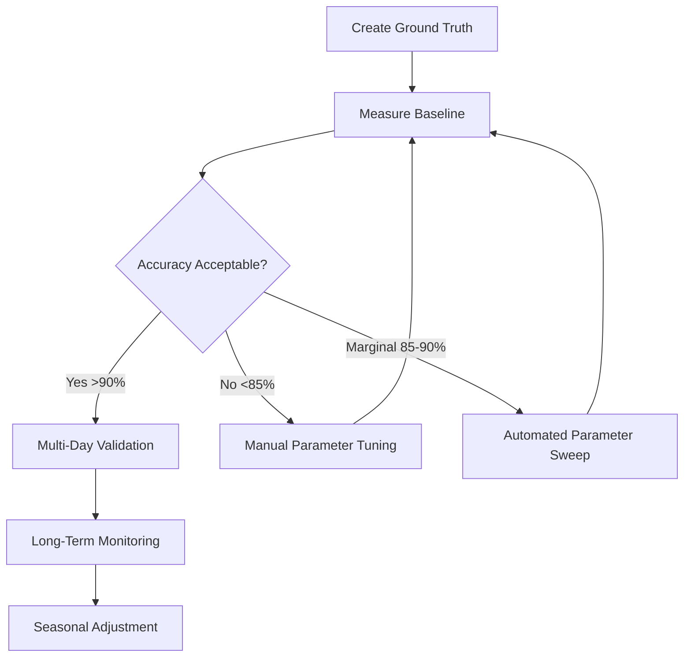

# WWV/WWVH Discrimination - Quick Start Guide

## Current Status: Ready for Testing & Tuning

### Implementation Complete ✅
- Joint least squares BCD amplitude estimation
- SNR-based coherence method selection
- Accurate signal bandwidth (1.5 Hz Hann ENBW)
- Consistent noise floor (825-875 Hz guard band)
- Weighted voting system with minute-specific priorities

---

## Immediate Next Steps

### 1. Create Ground Truth Dataset (1-2 days)
**Goal:** Identify 100+ minutes with known discrimination

**Method A: Geographic/Time-Based**
```bash
# Edit data/ground_truth_template.csv with known periods:
# - Early morning (0300-0600 UTC): WWV likely
# - Late evening (2100-0000 UTC): WWVH likely
# - Midday strong signals: Use 440 Hz detections as truth
```

**Method B: High-Confidence Periods**
```bash
# Extract minutes where 440 Hz clearly identifies station:
python3 scripts/extract_440hz_ground_truth.py \
    --date 20251119 \
    --channel "WWV 10 MHz" \
    --output data/ground_truth_440hz.csv
```

**Method C: Multi-Hour Stability**
```bash
# Periods where same station dominant for >3 hours
# likely indicate true single-station reception
```

### 2. Run Baseline Accuracy Test (30 minutes)
```bash
# Measure current performance
python3 scripts/measure_discrimination_accuracy.py \
    --date 20251119 \
    --channel "WWV 10 MHz" \
    --ground-truth data/ground_truth_periods.csv \
    --discrimination-csv /tmp/grape-test/analytics/WWV_10_MHz/discrimination/ \
    --output results/baseline_performance_20251119.json
```

**Expected Results:**
- Overall: 85-92%
- 440 Hz minutes (1/2): >95%
- BCD minutes (0,8-10,29-30): >90%
- Normal minutes: >85%

### 3. Identify Quick Wins (1-2 hours)

**Most Adjustable Parameters (High Impact):**

| Parameter | File | Line | Current | Test Range |
|-----------|------|------|---------|------------|
| Discrimination Threshold | `wwvh_discrimination.py` | 358, 367 | 3.0 dB | 2-5 dB |
| 440 Hz Weight | `wwvh_discrimination.py` | 326 | 10.0 | 8-15 |
| BCD Weight | `wwvh_discrimination.py` | 331 | 10.0 | 8-15 |
| Carrier Weight | `wwvh_discrimination.py` | 336 | 10.0 | 8-15 |
| Tick Weight | `wwvh_discrimination.py` | 327, 332, 337 | 5.0 | 3-8 |
| High Confidence Margin | `wwvh_discrimination.py` | 410, 419 | 0.7 | 0.6-0.8 |
| Medium Confidence Margin | `wwvh_discrimination.py` | 412, 421 | 0.4 | 0.3-0.5 |

**Manual Tuning Test:**
```python
# Edit wwvh_discrimination.py temporarily
# Change one parameter, save
# Reprocess data
python3 scripts/reprocess_discrimination_timerange.py \
    --date 20251119 \
    --channel "WWV 10 MHz" \
    --start-hour 18 \
    --end-hour 24

# Re-measure accuracy
python3 scripts/measure_discrimination_accuracy.py ...

# Compare to baseline
# If better → keep change
# If worse → revert change
```

### 4. Parameter Sweep (Automated, 2-4 hours)

**Create parameter config:**
```yaml
# config/sweep_weights.yaml
parameters:
  - name: w_440
    range: [8, 10, 12, 15]
  - name: w_bcd
    range: [8, 10, 12, 15]
  - name: w_carrier
    range: [8, 10, 12, 15]
  - name: w_tick
    range: [3, 5, 8]
```

**Run sweep:**
```bash
python3 scripts/discrimination_parameter_sweep.py \
    --config config/sweep_weights.yaml \
    --date 20251119 \
    --channel "WWV 10 MHz" \
    --ground-truth data/ground_truth_periods.csv \
    --output results/sweep_weights.json
```

---

## Key Files Reference

### Implementation
- **`src/signal_recorder/wwvh_discrimination.py`** - Main discrimination class
- **`src/signal_recorder/wwv_bcd_encoder.py`** - BCD template generation

### Documentation
- **`DISCRIMINATION_IMPROVEMENTS_2025-11-19.md`** - Complete technical documentation
- **`DISCRIMINATION_TESTING_TUNING_PLAN.md`** - Comprehensive testing plan (this guide)
- **`DISCRIMINATION_QUICK_START.md`** - This file

### Testing Scripts
- **`scripts/measure_discrimination_accuracy.py`** - Accuracy measurement ✅ Created
- **`scripts/discrimination_grid_search.py`** - Automated parameter search (TODO)
- **`scripts/ablation_study.py`** - Method importance testing (TODO)
- **`scripts/sensitivity_analysis.py`** - Parameter sensitivity (TODO)

### Data
- **`data/ground_truth_template.csv`** - Ground truth format example ✅ Created
- **`data/ground_truth_periods.csv`** - Your actual ground truth (TODO: populate)

---

## Current Parameter Values (Baseline)

### Integration Windows
```python
BCD Integration Window: 10 seconds
BCD Sliding Step: 1 second
Tick Window: 10 seconds (6 per minute)
```

### Thresholds
```python
Discrimination Threshold: 3.0 dB  # BALANCED vs station decision
Coherent SNR Advantage: 3.0 dB    # Coherent vs incoherent
440 Hz Detection: 10.0 dB          # SNR threshold
```

### Weight Factors
```python
# Minutes 1/2 (440 Hz dominant)
w_440 = 10.0
w_tick = 5.0
w_bcd = 2.0
w_carrier = 1.0

# Minutes 0,8-10,29-30 (BCD dominant)
w_bcd = 10.0
w_tick = 5.0
w_carrier = 2.0
w_440 = 0.0

# All other minutes (Carrier dominant)
w_carrier = 10.0
w_tick = 5.0
w_bcd = 2.0
w_440 = 0.0
```

### Confidence Margins
```python
BALANCED Threshold: 0.15  # |wwv_norm - wwvh_norm| < 0.15
High Confidence: margin > 0.7
Medium Confidence: margin > 0.4
Low Confidence: margin ≤ 0.4
```

---

## Success Metrics

### Minimum Acceptable ⚠️
- Overall: >85%
- High Confidence: >95%
- Minutes 1/2: >95%
- BCD Minutes: >90%

### Target 🎯
- Overall: >90%
- High Confidence: >97%
- Minutes 1/2: >98%
- BCD Minutes: >93%

### Stretch 🏆
- Overall: >95%
- High Confidence: >99%
- Minutes 1/2: >99%
- BCD Minutes: >95%

---

## Common Issues & Fixes

### Issue: Low Accuracy in BCD Minutes (<85%)
**Likely Cause:** Joint least squares not separating amplitudes well  
**Fix:** Increase BCD weight (10 → 15), or increase discrimination threshold (3 → 4 dB)

### Issue: Low Accuracy in Minutes 1/2 (<90%)
**Likely Cause:** 440 Hz detection too sensitive or not sensitive enough  
**Fix:** Adjust 440 Hz threshold (10 dB → test 7.5 or 12.5 dB)

### Issue: High/Medium Confidence Miscalibrated
**Likely Cause:** Margin thresholds don't match actual accuracy  
**Fix:** Adjust confidence margins (high: 0.7 → 0.75, medium: 0.4 → 0.45)

### Issue: Too Many BALANCED Classifications
**Likely Cause:** BALANCED threshold too wide  
**Fix:** Decrease BALANCED threshold (0.15 → 0.10)

### Issue: Temporal Instability (<90% consistency)
**Likely Cause:** Weights causing vote flipping between minutes  
**Fix:** Increase dominant method weight (10 → 15) to create stronger decisions

---

## Next Script Priorities

### High Priority (Create Next)
1. **`extract_440hz_ground_truth.py`** - Auto-generate ground truth from 440 Hz
2. **`discrimination_parameter_sweep.py`** - Automated weight tuning
3. **`plot_accuracy_vs_parameter.py`** - Visualize parameter sensitivity

### Medium Priority
4. **`ablation_study.py`** - Test method importance
5. **`continuous_monitoring.py`** - Real-time accuracy tracking
6. **`generate_performance_report.py`** - Daily/weekly reports

### Low Priority
7. **`cross_frequency_validation.py`** - Compare 5/10/15 MHz
8. **`seasonal_analysis.py`** - Long-term pattern detection

---

## Testing Workflow



---

## Quick Reference: Parameter Locations

**Discrimination Thresholds:**
- Line 358: BCD vote threshold (`if abs(bcd_ratio_db) >= 3.0`)
- Line 367: Carrier vote threshold (`if abs(result.power_ratio_db) >= 3.0`)
- Line 389: Tick vote threshold (`if abs(tick_ratio_db) >= 3.0`)

**Weight Assignments:**
- Lines 325-329: Minutes 1/2 (440 Hz priority)
- Lines 330-334: BCD minutes priority
- Lines 335-339: Normal minutes priority

**Confidence Margins:**
- Line 403: BALANCED threshold (`if abs(wwv_norm - wwvh_norm) < 0.15`)
- Lines 410, 419: High confidence (`if margin > 0.7`)
- Lines 412, 421: Medium confidence (`elif margin > 0.4`)

**Integration Windows:**
- Line 687: BCD window (`integration_window=10`)
- Line 688: BCD step (`sliding_step=1`)

---

**Status:** Implementation stable, ready for testing phase  
**Next Action:** Create ground truth dataset, run baseline accuracy test  
**Timeline:** 1-2 weeks for comprehensive tuning and validation
