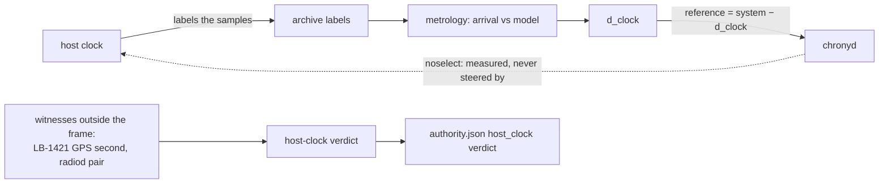

# How FUSION establishes T3

**Date:** 2026-09-05
**Status:** DRAFT (2026-09-05).  Michael's direction: keep this as a draft through the next period of testing, then rewrite it to describe the best working implementation as it stands.  The record of methods tried and abandoned stays useful as material but does not belong in that description; `BPSK-PPS-DETECTION-METHODS.md` and the design documents keep it.  Passages here that recount interim states or past miscalculations are candidates to leave out in the rewrite.
**Companion:** `T6_EDGE_METHODS_COMPARED.md` for the injected-PPS tier.  The
metrology framework: `MEASUREMENT_MODEL.md`, `TIMING_PROVENANCE_MODEL.md`,
`METROLOGY.md` §4.5.

---

## 1. The question T3 answers

A station with no TS-1 injector has no local edge to find.  It still hears
WWV from Fort Collins and WWVH from Kauai, each of which marks every minute
with an 800 ms tone that begins on the UTC minute at the transmitter.  Those
tones arrive late by the time light takes to cross the ground path plus the
extra the ionosphere adds, a few milliseconds each way that changes with the
hour and the frequency.  T3 asks: given when the markers arrived in our
samples and given what the propagation model says they should have taken,
how far does our clock sit from UTC?

The answer comes as `d_clock_fused_ms`, one number per fusion cycle, with an
uncertainty and a grade.  It reads as a correction to the host clock: true
time equals the host's reading minus d_clock.  That framing carries a
consequence the rest of this page returns to.

---

## 2. The path, end to end

```mermaid
flowchart TB
    WWV[WWV / WWVH transmitters<br/>800 ms marker on the UTC minute] -->|HF, 1-3 hops| ANT[antenna]
    ANT --> RX[RX888, disciplined by the 27 MHz GPSDO]
    RX --> RADIOD[radiod: one IQ channel per broadcast<br/>2.5, 5, 10, 15, 20, 25 MHz]
    RADIOD -->|RTP samples| REC[core-recorder<br/>archive chunks + sidecar]
    REC --> MET[metrology service, per channel, per minute<br/>L1: marker arrival vs model]
    MET --> L2[L2 calibration<br/>d_clock per broadcast + GUM budget]
    L2 --> FUSE[fusion<br/>Kalman per broadcast, calibration, validation, WLS]
    FUSE --> L3[L3 fusion_timing rows]
    FUSE --> STATUS[/run/hf-timestd/fusion_status.json]
    FUSE --> SHM[chrony SHM 1 'FUSE']
    STATUS --> AUTH[authority manager: T3 probe]
    AUTH --> AJ[authority.json → recorders §18]
    SHM --> CHRONY[chronyd → host clock]
    PROP[propagation model<br/>geometry + ionosphere] --> MET
    PROP --> L2
```

Six stages, one measurement point, three sinks.  The measurement happens
once, in the metrology service; everything downstream corrects, weighs,
checks and publishes it.

---

## 3. Stage by stage

### 3.1 The receiver and radiod

The GPSDO's 27 MHz disciplines the RX888, so the sample rate holds to a part
in 10⁹ and the RTP counter functions as a rigid ruler.  radiod opens one
channel per broadcast at 24 kHz complex.  Shared frequencies carry more than
one station (WWV and WWVH both key 2.5, 5, 10 and 15 MHz; BPM used to join
them and left fusion on 2026-02-07 for its 18 to 36 ms trans-Pacific
disagreement), so those channels carry the name SHARED and need a
discrimination step later.

### 3.2 The recorder

core-recorder writes the samples into ten-minute chunks with a sidecar that
states the registration in force for that chunk: since 2026-09-05 the schema
v2 state record, before that the Offset Judge's offset and tier.  The
metrology service reads these chunks; it never touches the network.

### 3.3 Metrology: the one measurement

`core/metrology_engine.py`, once per minute per channel.  The propagation
model predicts, for each station that may be present, when its minute
marker should arrive: ground distance over the speed of light, plus the
ionospheric delay for the mode the model expects (one hop off the F layer,
two hops, and so on), plus an uncertainty.  The engine correlates the
received audio against an 800 ms tone template inside a window three sigma
wide around that prediction and takes the correlation peak as the arrival.
The difference between the measured arrival and the predicted arrival
becomes the L1 row's `raw_toa_ms`, with the correlation SNR, the station the
arrival gate assigned, and a quality flag.  A correlation below 9.42 dB, or
one whose peak sits at the edge of the window, yields no row.

Two facts about this stage decide much of what follows.  First, it measures
one number per station per minute, and only when the marker stands clear of
the noise; on AC0G-B4 that happens in a few minutes an hour at some hours of
the day.  Second, the prediction it measures against already contains the
propagation model, so `raw_toa_ms` reads as a residual against that model,
not as a raw time of arrival.

The per-second ticks also pass through this engine.  Since 41d052a (2026-09-04)
the engine searches for them where the minute marker put the seconds, and it
withholds any ensemble anchored only on the host clock's label whose scatter
matches the search window.  Every such ensemble on both stations turned out to
be noise, so the tick feed to fusion now carries nothing until a marker
anchors it (`reference_tick_ensemble_is_noise`).

### 3.4 L2 calibration

`core/l2_calibration_service.py` reads L1 rows and writes one L2 timing
measurement per broadcast per minute.  It recomputes the propagation delay
with the full mode solver where available, else the geometric fallback with
an inflated uncertainty, and states `d_clock_ms`, the broadcast's estimate of
the host clock's offset, beside `raw_arrival_time_ms`, the reconstructed
arrival.  It assembles an uncertainty budget in the GUM manner, combining the
correlation's own precision, the model's propagation uncertainty and the
receiver's constant delays by Welch-Satterthwaite, and grades the result A
through D at 2, 4 and 8 ms.

### 3.5 Fusion

`core/multi_broadcast_fusion.py`, every eight seconds, over the last thirty
minutes of L2 rows.  The cycle runs in a fixed order.

1. **Read** the recent L2 measurements for every channel.
2. **Filter each broadcast** through its own Kalman filter, which tracks that
   path's slow ionospheric drift and holds the estimate across minutes with
   no detection.
3. **Remove constant hardware delays** learned per broadcast, the only
   calibration arithmetic that remains: every broadcast should read the same
   d_clock, so each broadcast's long-term mean offset from the ensemble is
   its hardware delay, updated slowly, refused when the update fails a
   sanity bound.
4. **Reject outliers** on the calibrated residuals with a median-absolute-
   deviation test, never rejecting everything.
5. **Validate.**  Stations must agree with each other within a bound
   (d_clock describes one clock, so WWV and WWVH must see the same number);
   frequencies of one station must agree (a frequency-dependent d_clock means
   the ionospheric term is wrong); a local GNSS VTEC reading, when fresh,
   cross-checks the model's TEC and tags the measurement, moving nothing.
6. **Fuse** by weighted least squares.  Weights come from the grade, the
   propagation mode, the SNR and the discrimination confidence.  The result
   carries the WLS uncertainty, the number of stations and broadcasts, and a
   Kalman state: LOCKED once the per-broadcast filters have converged,
   ACQUIRING or REACQUIRING before that.
7. **Publish** to three sinks (§4).

A leap-second hold surrounds a month end when a broadcast has announced one
(WWVB's bits, WWV's BCD), and a jump limiter holds the published d_clock to
5 ms of change per cycle after a restart.

---

## 4. The three sinks, and what each one means

**L3 rows.**  `L3_fusion_timing` in the station's SQLite store, one row per
cycle: d_clock, uncertainty, grade, stations, consistency flags.  The
science products and the overclaim gate read from here.

**fusion_status.json.**  Rewritten every cycle for the authority manager,
which runs the T3 probe against it: T3 counts as available when the file is
fresh, the Kalman state reads LOCKED, and at least two stations contributed.
The manager then publishes T3's d_clock as `rtp_to_utc_offset_ns` in
`authority.json`, where the recorders read it to place their WSPR and FT8
slot boundaries.  T3 ranks below T4, T5 and T6, so on a station with any of
those it serves as backup and as a measurement of how well HF alone can do.

**chrony SHM unit 1, refid FUSE.**  A refclock sample: reference time equals
the host's system time minus d_clock, paired with that system time.  chrony
treats it like any other source, weighs it by the precision fusion states,
and, where the station has no LAN stratum-1, may select it.

---

## 5. What T3 does not do, and the loop that follows from it

T3 measures independently of the host clock: the marker's position in the
samples comes from the GPSDO-ruled counter, not from `time.time()`.  But the
number it publishes describes the host clock, because the recorder labelled
those samples with the host's registration in the first place.  When the host
clock walks, the labels walk with it, the measured arrivals walk with them,
and d_clock changes by the same amount.  fusion then tells chrony "true time
equals your reading minus d_clock", chrony steers by it, and the labels move
again.  On 2026-09-04 that loop carried AC0G-B4 11.6 s from UTC over thirteen
hours while every internal figure read "on time"
(`reference_fuse_walk_mechanism`, `HOST_CLOCK_INTEGRITY.md`).

Two guards now stand around the loop, and one rule closes it.  The host-clock
verdict compares the host against witnesses that share no frame with it: the
LB-1421's GPS second and radiod's pair.  `trust` no longer decorates FUSE in any
station's chrony configuration, so the pool can outvote it.  And since
2026-09-10 (`MEASUREMENT_MODEL.md` §7.1.1) FUSE and HPPS carry `noselect` for
good: chrony measures them and never steers by them, so the loop in the figure
never closes through chronyd.  A refclock gate used to withdraw FUSE from
selection while the verdict read suspect or fault; it earned its keep on
AC0G-ND on the night of 2026-09-04 (two withdrawals on a suspect verdict, one
when T3 fell away at 02:34Z, the host within a millisecond of the pool while
FUSE read minus 96 ms by morning) and retired on 2026-09-11, because a source
that never votes needs no gate.



---

## 6. What T3 is good for, and how good

Where the ionospheric model holds and several broadcasts stand clear of the
noise, fusion converges to a d_clock within about half a millisecond of the
truth, and its uncertainty says so.  That suffices to start a two-minute WSPR
period or a fifteen-second FT8 period on the right second with margin to
spare, and it suffices for time-of-arrival science at the millisecond level.
It does not reach the microsecond class T6 reaches, and it cannot, because the
ionosphere sits in the path and the model of it carries millisecond
uncertainty.

Where fusion falls short shows in three ways.  A station hears one station
only, so the cross-station check has nothing to compare; the grade drops.
The marker detects rarely, so the Kalman filters coast and the uncertainty
grows.  Or the model errs for a mode the solver did not expect, as WWVH at
2.5 MHz on AC0G-ND did last night at 81 ms, and the sanity bound refuses the
calibration update while the fused number drifts.  Each of these shows in the
grade, the consistency flags and the Kalman state, all of which the sidecar
and the authority record carry.

---

## 7. Where the measurement happens, in one table

| Stage | Reads | Measures or computes | Writes |
|---|---|---|---|
| radiod | RF | samples on a GPSDO-ruled counter | RTP packets, GPS_TIME/RTP_TIMESNAP pair |
| core-recorder | RTP | labels samples from the registration in force | chunks + sidecar (v2 state record) |
| metrology | chunks, propagation model | **marker arrival vs predicted arrival** | L1 rows (`raw_toa_ms`, SNR, station, flag) |
| L2 calibration | L1, propagation model | d_clock per broadcast + uncertainty budget | L2 rows |
| fusion | L2 (30 min) | Kalman per broadcast, calibration, validation, WLS | L3 rows, fusion_status.json, chrony FUSE |
| authority manager | fusion_status.json + witnesses | T3 availability, host-clock verdict, gate | authority.json, chrony selectopts |

The measurement in bold happens once.  Everything else corrects or judges it.
When T3 misbehaves, the place to look first is the L1 row: did the marker
detect, at what SNR, against which prediction.  The place to look second is
the host-clock verdict, because a walking host moves every number downstream
of the labels while leaving each one internally consistent.

## 8. Relation to T6

T6 and T3 share the architecture: a known-timed signal found in the samples
and related to the counter.  They differ in the signal.  T6's edge arrives
through cable with no medium in the way; T3's marker arrives through the
ionosphere.  T6 names its second from a local GPS receiver and publishes a
counter-to-UTC anchor the host clock never touches; T3 publishes a correction
to the host clock.  On a station with both, T6 carries the tier and T3 stands
as the witness that a receiver with no injector could still keep a clock to
half a millisecond.  On a station with only T3, the guards of §5 are the
whole defence.
