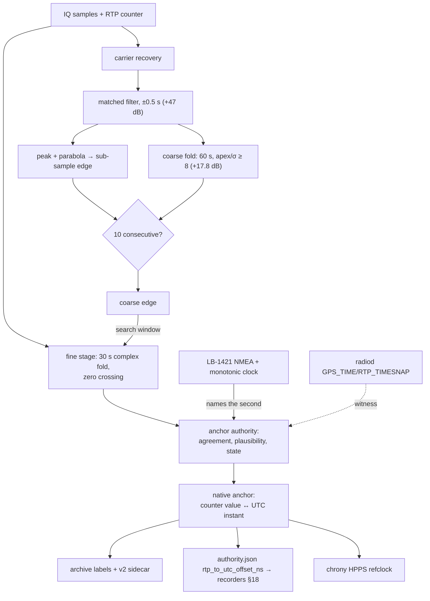

# T6: recovering UTC from a BPSK pilot's once-per-second polarity flip

**Date:** 2026-09-10 (rewritten from the 2026-09-05 draft)
**Status:** Describes the working implementation. The record of methods tried and
abandoned lives in `BPSK-PPS-DETECTION-METHODS.md`; parameter tuning within the
present method lives in `HF-PPS-CHRONY-TUNING.md`. A companion page,
`T3_FUSION_EXPLAINED.md`, covers how FUSION establishes T3.

**What defines the quantities:** `MEASUREMENT_MODEL.md` (one measurand, one ruler,
one registration) and `TIMING_PROVENANCE_MODEL.md` (the record a consumer reads).
This page describes a method; those pages say what the method measures.

---

## 1. What T6 promises

T6 answers one question: **what UTC instant does sample *n* carry**, stated with an
uncertainty, holding across restarts and through the night.

That phrasing matters. A simpler system asks where in the second a pulse sits, which
serves alignment and nothing else. T6 turns the pulse into a *registration* — one
counter value paired with one UTC instant — and hands that registration to three
consumers at once.

---

## 2. The signal

An LB-1421 GPS-disciplined oscillator produces 1 PPS and a 27 MHz reference. A TS-1
injector (Paul Elliott, WB6CXC) turns the PPS into a 45.375 MHz carrier whose polarity
flips once per second on the edge. Between flips the carrier carries nothing. The TS-1
couples that carrier into the receive path **ahead of the RX888**, and the same 27 MHz
reference disciplines the converter. radiod tunes a channel to 45.375 MHz, filters
±25 kHz, and emits complex samples at 96 kHz with an RTP timestamp on every packet.

Two consequences follow, and they shape everything below.

**No ionosphere sits in this path.** The injector feeds the receiver directly, so what
separates the edge in the samples from the edge at the GPS antenna amounts to cable,
the injector's own delay and the converter's group delay. Those sum to a constant —
16.618 ms at AC0G-B4 — not to a propagating path with weather in it.

**One reference governs both the pilot and the ruler.** The GPSDO disciplines the
carrier that carries the edge and the converter that samples it. Errors common to both
cancel, which is why T6 outranks a tier of nominally higher stratum
(`reference_why_t6_outranks_t4`). Stratum counts hops; a tier counts what cancels.

---

## 3. Finding the edge

Four stages cooperate. Each buys processing gain the previous one could not.

### 3.1 Carrier recovery

`core/bpsk_pps_calibrator_mf.py` estimates residual carrier phase per batch by squaring
the samples and halving the angle, low-pass filtered across batches. Rotating by that
phase puts the polarity on the real axis, so a sign flip becomes a step in a real signal
rather than a rotation in a complex one.

### 3.2 Matched filter, half a second either side

A boxcar filter sums the next half-second of in-phase samples and subtracts the previous
half-second. For a signal that flips once per second this template maximises output SNR.
The output climbs to a triangular apex of height N·A at every flip, N being 48 000
samples — about **47 dB** over deciding from one sample. A three-point maximum test finds
peaks, a parabola through the three samples around each peak places the edge below one
sample, and two gates (a position tolerance, a minimum gap) separate edges from noise.
Ten consecutive edges lock.

The apex spans half a second, and that width costs what the gain buys. At low C/N0 the
noise ripple along the apex moves the argmax by roughly 100 samples from one second to
the next, past the tolerance, and the run never closes. On AC0G-B4 that happened every
night between 48 and 57 dB-Hz (`reference_t6_cn0_cliff_agc`).

### 3.3 Coarse fold

The same module folds its own matched-filter output. Each second's output, sign-alternated
because the flip alternates, accumulates into a bin indexed by the counter modulo one
second and averages over 60 s. The apex grows as 60 while the noise grows as √60 — a
further **17.8 dB**. A triangle fitted at the apex, against the residual around it, gives
an apex-over-sigma figure; above 8 the fold registers the edge with the same authority ten
consecutive edges would grant.

Against the synthetic generator the fold locks from 50 dB-Hz, where the per-edge path never
locks, down to 40 dB-Hz, placing the edge inside half a sample. Once a fold reference exists
it defines the chain delay and the tolerance reference, so a single noisy edge can no longer
re-base either.

⚠ The template must stay **antisymmetric**. A symmetric one flattens the apex and the fit
then localises a plateau rather than a peak (`reference_t6_mf_triangle_apex`).

### 3.4 Fine stage

`core/bpsk_edge_fine_stage.py` folds thirty seconds of complex baseband modulo the sample
rate, sign-alternating per second, indexed by stream continuity rather than by each packet's
declared counter — so the measured ±60-sample packet mislabelling averages out. Carrier phase
comes from the folded samples away from the transition. Within a few milliseconds of the
coarse position the stage fits a line through the central ramp of the averaged in-phase
component and reads the zero crossing to a fraction of a sample. A symmetric crossing makes
amplitude tilt a second-order effect.

Given no coarse seed the stage finds the edge itself in the folded second
(`T6_FOLDED_SELF_ACQUISITION.md`), and it confirms a self-acquired edge across three fold
blocks before trusting it.

---

## 4. Naming the second, and the inversion

An edge position within the second still needs a second. hf-timestd takes it from the
LB-1421's own NMEA sentence over USB, paired to the counter through a **monotonic** clock —
never through the host's wall clock (`_t6_name_second_via_nmea`).

The named edge then becomes the native anchor: one counter value, one UTC instant. Every
sample's UTC follows by counter arithmetic at the GPSDO's rate.

⚡ **The inversion is the design's centre.** radiod's (GPS_TIME, RTP_TIMESNAP) pair descends
from the host clock. Earlier the edge was measured *against* that pair, which made T6 a
measurement of the host clock wearing a metrology costume. Now the edge registers the ruler
and the pair becomes a **witness** (`T6_ANCHOR_INVERSION_DESIGN.md`). Nothing in the chain
consults the host clock for a value it then reports as truth.

`t6_anchor_authority.py` watches the fine and coarse stages agree, watches the edge stay
plausible against its own learned history (`t6_reference_resolver`), and moves the tier
through ACQUIRING, AUTHORITATIVE, DEGRADED and WITHDRAWN.

---

## 5. What T6 produces, and who reads it



Three sinks read the anchor. The **archive writer** labels every sample from it, so recorded
IQ carries UTC independent of the host clock, and the chunk sidecar states the registration in
force with its uncertainty and origin. The **authority manager** publishes it as
`rtp_to_utc_offset_ns` in `authority.json`, which the recorders read through contract §18 to
start and end WSPR and FT8 slots on the sample the edge names. And **chrony** receives HPPS, a
refclock sample built from the anchor and an arrival-floor estimate of host time rather than
from the moment of the push (`t6_shm_pair.py`).

⚠ HPPS is **not** a hardware PPS. It is the HF pulse-per-second recovered from the TS-1 BPSK
carrier. Anything that reads it as a wire PPS will draw the wrong conclusion about its
independence.

---

## 6. What it delivers, measured

From AC0G-B4, the only station running T6, on 2026-09-10 (deployed revision `b79e831`):

```
T6 LABEL AUDIT: batches=18,148,922  mismatched=0 (0.00%)  cumulative_drift=+0 samples (+0.000 ms)
```

Eighteen million batches labelled, not one mismatch, no accumulated drift. That is the claim
the whole chain exists to support, and it holds.

Two figures qualify it. The tier moved **AUTHORITATIVE ↔ DEGRADED 28 times in 24 hours**, and
HPPS withdrew 9 times. So T6 labels samples correctly and continuously while its *confidence*
in doing so flaps roughly hourly. The label audit measures internal consistency; the state
machine measures whether the evidence justifies the label. They disagree, and the disagreement
is the honest current state.

Between fixes, the registration coasts at the ruler's rate — **1.44 µs/hr measured**
(`reference_t6_holdover_coast`). That number is the general law for a registration held on a
governed oscillator, not a T6 peculiarity.

---

## 7. Where it fails

**The Costas loop.** Its excursions gate acceptance for tens of seconds, and it re-acquires at
a different operating point after each restart.

**The apex, at low C/N0.** The half-second width that supplies the gain also supplies the
nightly ambiguity. The coarse fold addresses it, and folding held 7 hours with zero transitions
down to 46.7 dB-Hz in the 2026-08-29 programme. ⚠ On B4 today the fold emits roughly one log
line every six hours, and since it speaks only when it locks or fails, log volume alone cannot
say whether it carries the load. Settling that needs instrumentation, not inference.

**Wrong-peak locks.** A fold lattice can present phantom peaks at a regular spacing — B4 locked
onto a 20.000 ms lattice on 2026-09-04 (`project_b4_t6_wrong_lock_20260904`). The reference gate
and the cross-bench judge catch them, at the cost of more state.

**Chain delay changes meaning at every radiod channel re-creation**, because the counter's origin
moves. Anything comparing chain delays across restarts must compare them against UTC, never
against each other.

**The C/N0 cliff is stochastic**, near 58-59 dB-Hz, with sigma running about 12 % per dB
(`reference_t6_cn0_cliff_agc`). Approaching it degrades gracefully in the mean and abruptly in
any given minute.

---

## 8. What T6 is not

⛔ **T6 cannot be the host clock's electorate.** The edge arrives through the sample stream, so
the measurement lives in sample time and inherits the converter's rate. A source that inherits
the quantity it would check cannot vote on it. The GPSDO governs that converter, which makes the
inheritance benign in practice — but "benign in practice" is a station condition, not a property,
and a station whose GPSDO drive fell to 8 mA sampled 350 ppm fast while every self-check read
healthy. Sources outside the sample stream hold the vote. See `MEASUREMENT_MODEL.md` §7.1.1.

⛔ **T6 is not a propagation measurement.** No ionosphere sits in this path, so nothing here says
anything about the sky. The 16.618 ms is hardware.

⛔ **A T6 anchor and a T6 fold on the same channel are not two witnesses.** One antenna, one
converter, one path.

---

## 9. Why not the simpler method

`wd-record` in ka9q-radio (Scott Newell) finds the same flip with a per-sample phase-step state
machine: no carrier recovery, one sample of resolution, a few operations per sample in C. It
aligns recordings to the PPS, and for that purpose it is the right size of tool.

T6 costs a Python service and tens of milliseconds per batch to answer the harder question —
a registration with a stated uncertainty that survives restarts and serves three consumers. The
two methods find the same edge and promise different things about it afterwards.

Running Newell's detector beside ours as an independent estimator of the same edge remains
worthwhile, and `BPSK-PPS-DETECTION-METHODS.md` §5 records how to measure the difference on data
the stations already hold.
